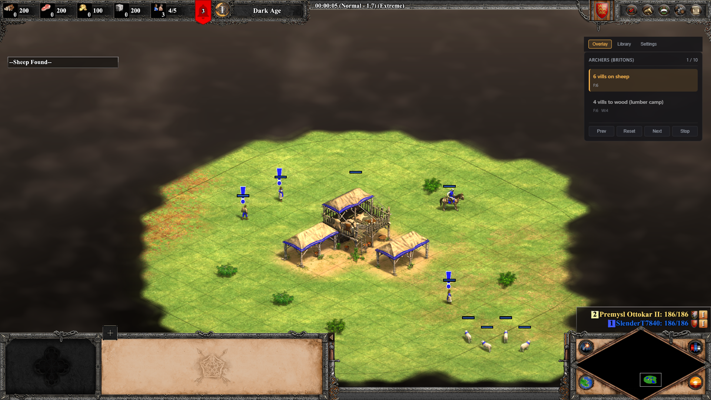

<p align="center">
  
</p>

<h1 align="center">Open Age</h1>

<p align="center">
  <a href="https://github.com/nikrich/open-age/actions/workflows/release.yml"></a>
  <a href="https://opensource.org/licenses/MIT"></a>
  <a href="https://github.com/nikrich/open-age/releases"></a>
  <a href="https://www.rust-lang.org/"></a>
  <a href="https://tauri.app/"></a>
</p>

A lightweight, transparent, always-on-top desktop overlay that helps players learn and execute build orders in Age of Empires II: Definitive Edition.


Open Age reads game state from the screen via OCR (no memory injection, no anti-cheat risk) and either auto-advances build order steps based on resource/villager/time triggers, or allows manual advancement via global hotkey.

---

## Features

- **Transparent overlay** that stays on top of the game without stealing focus
- **Build order library** with YAML-based build orders (easy to create and share)
- **Manual step advancement** via global hotkeys while the game has focus
- **Auto-advance** (coming soon) based on OCR reading of in-game resources, villager count, and game time
- **Trigger system** with AND/OR logic for flexible step conditions
- **Configurable hotkeys** for all overlay actions
- **Minimal footprint** targeting <100MB RAM and <3% CPU

## Screenshots

<p align="center">
  
</p>

<p align="center"><sub>The overlay sits in the top-right corner of AoE2:DE — current step highlighted, next step queued, no focus stealing.</sub></p>

## Installation

### Download

Download the latest installer from the [Releases](https://github.com/nikrich/open-age/releases) page:

- **Windows:** `.msi` or `.exe` installer

### Requirements

- Windows 10/11
- Age of Empires II: Definitive Edition running in **borderless fullscreen** mode (the default)

## Usage

1. Launch Open Age
2. Go to the **Library** tab and select a build order
3. The overlay shows the current step with an amber highlight and the next step below
4. Use hotkeys to navigate:

| Action | Hotkey |
|---|---|
| Next step | `Ctrl+Alt+Right` |
| Previous step | `Ctrl+Alt+Left` |
| Reset to start | `Ctrl+Alt+R` |
| Toggle overlay | `Ctrl+Alt+H` |

5. Drag the header bar to reposition the overlay

## Build Orders

Open Age ships with three sample build orders:

| Build Order | Civilization | Difficulty |
|---|---|---|
| Scouts (Generic) | Any cavalry civ | Beginner |
| Archers (Britons) | Britons | Beginner |
| Fast Castle into Knights | Any cavalry civ | Intermediate |

### Creating Custom Build Orders

Build orders are YAML files. Place them in your app data directory under `build-orders/user/`.

```yaml
id: my-build-order
name: "My Custom Build"
civilization: Generic
author: YourName
description: "Description of the strategy."
tags: [custom, feudal-aggression]

steps:
  - action: "6 vills on sheep"
    at: { time_seconds: 0 }
    villagers_assigned: { food: 6, wood: 0, gold: 0, stone: 0 }

  - action: "Lure boar"
    at: { villagers: 10 }
    notes: "Shoot boar once, garrison in TC."

  - action: "Click up to Feudal"
    at: { villagers: 21, food_min: 500 }
```

### Trigger Conditions

Each step has an `at` field that defines when it should activate:

| Field | Description |
|---|---|
| `time_seconds` | Game time in seconds |
| `villagers` | Minimum villager count |
| `population_min` | Minimum population |
| `food_min` | Minimum food |
| `wood_min` | Minimum wood |
| `gold_min` | Minimum gold |
| `stone_min` | Minimum stone |
| `mode` | `All` (AND, default) or `Any` (OR) |

---

## Development

### Prerequisites

- [Rust](https://rustup.rs/) 1.75+
- [Node.js](https://nodejs.org/) 20+
- [Tauri CLI](https://tauri.app/) 2.0+

```bash
cargo install tauri-cli --version "^2.0"
```

### Setup

```bash
git clone https://github.com/nikrich/open-age.git
cd open-age
npm install
```

### Run in Development

```bash
cargo tauri dev
```

### Run Tests

```bash
cd src-tauri
cargo test
```

### Build for Release

```bash
cargo tauri build
```

Outputs are in `src-tauri/target/release/bundle/`:
- `msi/AoE Overlay_0.1.0_x64_en-US.msi`
- `nsis/AoE Overlay_0.1.0_x64-setup.exe`

---

## Architecture

```
open-age/
├── src-tauri/               # Rust backend
│   └── src/
│       ├── main.rs          # Tauri setup, command handlers
│       ├── state.rs         # AppState, GameState, Settings
│       ├── build_order/     # Build order types, parser, engine
│       ├── capture/         # Screen capture (Phase 2)
│       ├── ocr/             # OCR pipeline (Phase 3)
│       ├── hotkeys.rs       # Global hotkey registration
│       ├── storage.rs       # File-based persistence
│       └── ipc.rs           # Tauri IPC commands/events
├── src/                     # React frontend
│   ├── components/          # Overlay, StepCard, Library, Settings
│   ├── hooks/               # Tauri event hooks
│   └── styles/              # Overlay CSS
└── build-orders/            # Sample YAML build orders
```

### Tech Stack

| Component | Technology |
|---|---|
| Backend | Rust + Tauri 2.0 |
| Frontend | React + TypeScript + Vite |
| Build Orders | YAML / JSON |
| Hotkeys | `global-hotkey` crate |
| Styling | Plain CSS |
| CI/CD | GitHub Actions |

---

## Roadmap

| Phase | Status | Description |
|---|---|---|
| Phase 1 | Done | Manual-advance overlay with build order library |
| Phase 2 | Planned | Screen capture + calibration UI |
| Phase 3 | Planned | OCR pipeline for reading game state |
| Phase 4 | Planned | Auto-advance based on triggers |
| Phase 5 | Planned | Build order editor, settings UI, polish |

---

## Contributing

Contributions are welcome! Here's how to get started:

1. **Fork** the repository
2. **Create a branch** for your feature: `git checkout -b feat/my-feature`
3. **Make your changes** with tests where applicable
4. **Run the test suite**: `cd src-tauri && cargo test`
5. **Commit** with a descriptive message: `git commit -m "feat: add my feature"`
6. **Push** and open a **Pull Request**

### Guidelines

- Follow the existing code style and patterns
- Write tests for new Rust code (TDD preferred)
- Keep commits focused and atomic
- Use [conventional commits](https://www.conventionalcommits.org/): `feat:`, `fix:`, `docs:`, `ci:`, etc.
- Build orders contributions are welcome — add YAML files to `build-orders/`

### Claude Code Skills

This repo includes Claude Code skills in `.claude/skills/` for AI-assisted development:

- **Tauri skills** (39 skills) — Tauri v2 setup, security, IPC, distribution, window customization
- **Rust skills** (179 rules) — Ownership, error handling, async patterns, API design, testing, anti-patterns

These are automatically used by Claude Code when working on this project.

---

## FAQ

**Will this get me banned?**
No. Open Age uses read-only screen capture (the same as OBS or any screenshot tool). It does not inject into game memory, modify game files, or send any input to the game. It is indistinguishable from a screen recording app.

**Does it work in fullscreen mode?**
It works in **borderless fullscreen** (the default AoE2:DE setting). Exclusive fullscreen is not supported.

**Can I use it for AoE4?**
Not yet. The architecture supports it, but AoE4-specific calibration and OCR templates are not implemented. Planned for a future version.

**Can I share build orders?**
Yes! Build orders are plain YAML files. Share them however you like, or contribute them to this repo.

---

## License

This project is licensed under the MIT License. See [LICENSE](LICENSE) for details.

---

## Acknowledgments

- Built with [Tauri](https://tauri.app/) and [React](https://react.dev/)
- Build order data inspired by community guides from [AoE2 Build Order Reference](https://buildorderreference.com/) and [Hera's YouTube tutorials](https://www.youtube.com/@HeraAgeofEmpires2)
